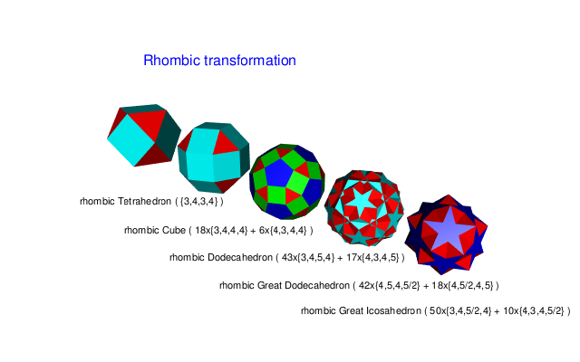

# Polyhedra

R tools to create various polyhedra from ground principles.


Only the coordinates of the very basic polyhedra are given (tetrahedron, octahedron, icosahedron). The topology of those is not given but "discovered" by the tool. Other polyhedra are created as derived from these. E.g. the dodecahedron is created as

```r
dodecahedron <- dual(icosahedron)
```

The basic stellated polyhedra ("Kepler-Poinsot polyhedra") have the same coordinates as the simpler ones and can be created from these

```r
greatDodecahedron <- buildRegularPoly(coords = icosahedron$coords, 
                                      polygonsize = 5, vertexsize = 5, exampleEdge = c(1,6),
                                      name = "Great Dodecahedron")
smallStellatedDodecahedron <- buildRegularPoly(icosahedron$coords,
                                               polygonsize = 5,
                                               vertexsize = 5,
                                               exampleEdge = c(1,7),
                                               name = "Small Stellated Dodecahedron")
greatIcosahedron <- buildRegularPoly(icosahedron$coords,
                                     polygonsize = 3,
                                     vertexsize = 5,
                                     exampleEdge = c(2, 6),
                                     name = "Great Icosahedron")
greatStellatedDodecahedron <- dual(greatIcosahedron, name = "Great Stellated Dodecahedron", scaling = "vertex")
```


Basic descriptions of the polyhedra (according to Coxeter) are also generated along with the polyhedra.

Next to "dual", several other transformations like "truncate" and "rhombic" are available too, allowing to create a lot of different polyhedra



There also is a full discovery mode, where you only give a set of coordinates (from one of the other polyhedra) then it "discovers" a family of polyhedra sharing those vertex coordinates.


The above is not a full list. Run the R notebook to create a more complete list.

Next up is a tool to automatically create a 2D layout of the polyhedra.


