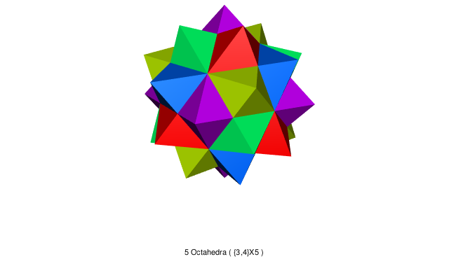

# Polyhedra

R tools to create various polyhedra from ground principles.



## Getting started

This repository is script-based, so you can use it interactively from R or run the helper script to create browser-rendered polyhedron output.

### Install dependencies

In R:

```r
install.packages(c(
  "data.table",
  "rgl",
  "testthat",
  "ggplot2",
  "svglite",
  "colorspace",
  "htmlwidgets"
))
```

### Run browser visualization without XQuartz

From the repo root:

```bash
cd /Users/ottoperdeck/dev/polyhedra
Rscript visualize_browser.R icosahedron
```

This generates and opens an HTML file like `rgl_Icosahedron.html`.

### Render the notebook

If you want to reproduce the full notebook, run:

```r
rmarkdown::render("polyhedra.Rmd")
```

That will generate `polyhedra.html` from `polyhedra.Rmd`.

### Use interactive R / VS Code

```r
setwd("/Users/ottoperdeck/dev/polyhedra")
source("polyhedra.R")
source("draw.R")

widget <- drawSinglePolyWidget(icosahedron)
widget
```

Or draw multiple objects:

```r
widget <- drawPolyWidget(list(tetrahedron, cube, icosahedron))
widget
```

Only the coordinates of the very basic polyhedra are given (tetrahedron, octahedron, icosahedron). The topology of those is not given but "discovered" by the tool. Other polyhedra are created as derived from these. E.g. the dodecahedron is created as

```r
dodecahedron <- dual(icosahedron)
```

## Browser-based visualization

This project now prefers browser-based `rglwidget()` rendering on macOS. That is the recommended mode for the notebook and for interactive use, and it avoids XQuartz.

Install dependencies once:

```r
install.packages(c(
  "data.table",
  "rgl",
  "ggplot2",
  "svglite",
  "colorspace",
  "htmlwidgets",
  "rmarkdown"
))
```

Run a browser visualization:

```bash
cd /Users/ottoperdeck/dev/polyhedra
Rscript visualize_browser.R icosahedron
```

Render the notebook:

```bash
cd /Users/ottoperdeck/dev/polyhedra
Rscript -e 'rmarkdown::render("polyhedra.Rmd")'
```

That creates `polyhedra.html` from `polyhedra.Rmd` and embeds the interactive 3D widgets.

Use interactive R / VS Code:

```r
setwd("/Users/ottoperdeck/dev/polyhedra")
source("polyhedra.R")
source("draw.R")

widget <- drawSinglePolyWidget(icosahedron)
widget
```

Or render multiple shapes:

```r
widget <- drawPolyWidget(list(tetrahedron, cube, icosahedron))
widget
```

The basic stellated polyhedra ("Kepler-Poinsot polyhedra") have the same coordinates as the simpler ones and can be created from these:

```r
greatDodecahedron <- buildRegularPoly(coords = icosahedron$coords,
                                      polygonsize = 5, vertexsize = 5, exampleEdge = c(1,6),
                                      name = "Great Dodecahedron")
smallStellatedDodecahedron <- buildRegularPoly(icosahedron$coords,
                                               polygonsize = 5,
                                               vertexsize = 5,
                                               exampleEdge = c(1,7),
                                               name = "Small Stellated Dodecahedron")
greatIcosahedron <- buildRegularPoly(icosahedron$coords,
                                     polygonsize = 3,
                                     vertexsize = 5,
                                     exampleEdge = c(2, 6),
                                     name = "Great Icosahedron")
greatStellatedDodecahedron <- dual(greatIcosahedron, name = "Great Stellated Dodecahedron", scaling = "vertex")
```

Basic descriptions of the polyhedra (according to Coxeter) are also generated along with the polyhedra. Other transformations such as `truncate()` and `rhombic()` are available too.


