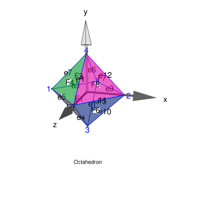
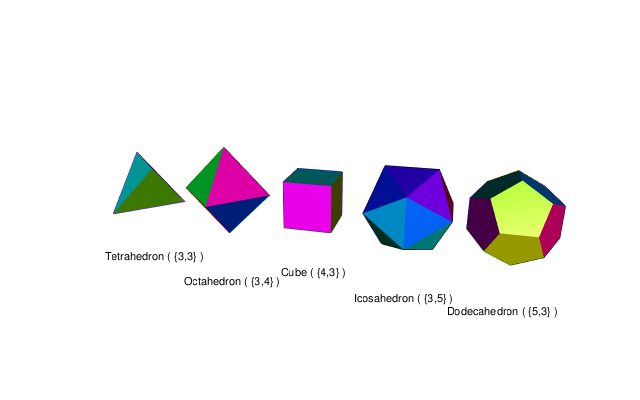
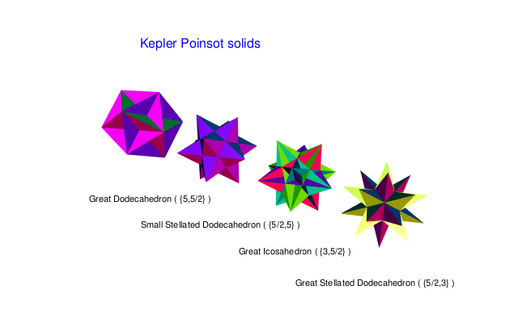
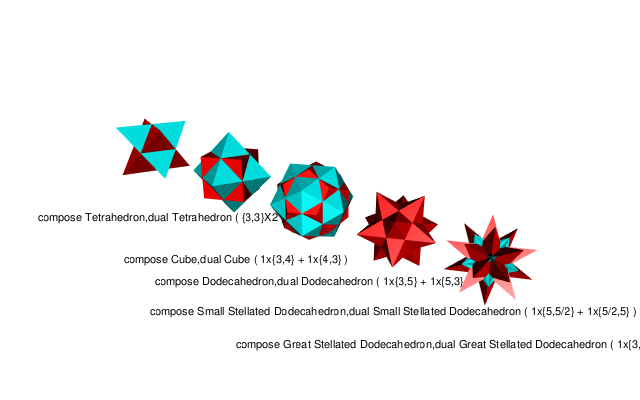
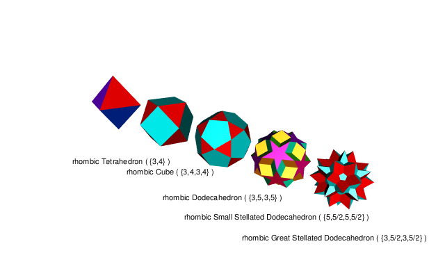
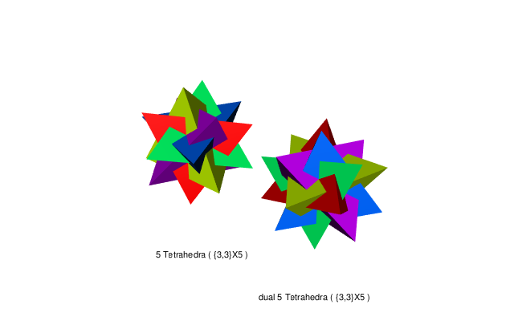
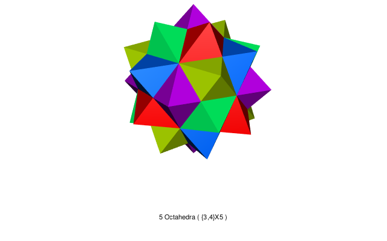
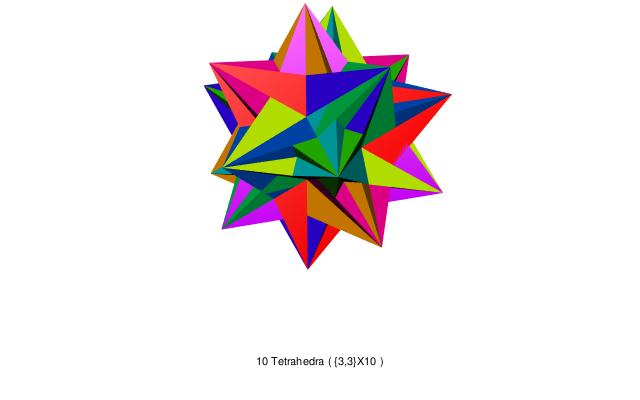
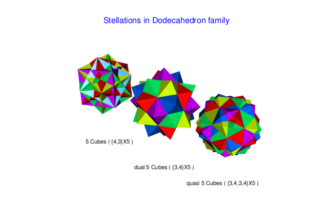

This is an [R Markdown](http://rmarkdown.rstudio.com) Notebook to explore the construction of polyhedra using the construction code from (https://github.com/operdeck/polyhedra).

A small list of basic polyhedra is constructed from pre-defined sets of coordinates and topology. More complex polyhedra can be built using transformations that turn them into their dual, snubbing, truncating, stellation and more. In addition there is a discovery mode where the vertices of one polyhedron are used to discover others by trying to fit different faces onto the vertices.

PS inspiration for a very nice RPub: http://rpubs.com/RexGalilae/weather-events

# The Platonic solids

A Platonic solid is a convex polyhedron whose faces and vertices are all of the same type. There are five such solids.

In this project, three of the Platonic solids are sort-of pre-defined. They are constructed from a set of vertex coordinates (given), a polygon and vertex description and an example edge size. 

For example, below we construct an octahedron by passing in the 8 vertex coordinates, the size of the faces (3) ,the number of faces that each vertex has (4) and the edge size (size from vertex 1 to vertex 3). The *buildRegularPoly* function will then fit a number of faces (not specified up front) that fit this specification and use up all points.

```{r, warning=F, comment=F}
source("polyhedra.R")
source("draw.R")

octahedron <- buildRegularPoly(coords = rbind(expand.grid(x = c(-1,1), y = 0, z = 0), 
                                                expand.grid(x = 0, y = c(-1,1), z = 0), 
                                                expand.grid(x = 0, y = 0, z = c(-1,1))),
                               polygonsize = 3,
                               vertexsize = 4,
                               exampleEdge = c(1,3),
                               name = "Octahedron")
```

```{r, include=F}
rgl_init(width=400, height=400)
drawSinglePoly(octahedron, debug = T)
snapshot3d("snapshots/octahedron.png", fmt = "png", top = TRUE )
```



The tetrahedron and icosahedron are defined in a similar way in the project. The other two Platonic solids are derived by applying a *dual* transformation. Together that gets us the 5 Platonic colids:

```{r, warning=F, comment=F}

cube <- dual(octahedron, name = "Cube")
dodecahedron <- dual(icosahedron, name = "Dodecahedron")

Platonics <- list(tetrahedron, octahedron, cube, icosahedron, dodecahedron)
```

```{r, include=F}
# TODO use screen better / other viewpoint
rgl_init(width=640, height=400, new.device = T)
drawPoly(Platonics, start = c(1, 1, 1), delta = c(2, 0, 0))
snapshot3d("snapshots/platonics.png", fmt = "png", top = TRUE )
```



# The Kepler-Poinsot polyhedra

The 4 other regular polyhedra can be derived from the Platonic solids by fitting other faces through the  vertex coordinates. The great stellated dodecahedron is defined as the dual of the great icosahedron but could have been defined in the same manner as the other three.

```{r}
greatDodecahedron <- buildRegularPoly(coords = icosahedron$coords, 
                                      polygonsize = 5, vertexsize = 5, exampleEdge = c(1,6),
                                      name = "Great Dodecahedron")
smallStellatedDodecahedron <- buildRegularPoly(icosahedron$coords,
                                               polygonsize = 5,
                                               vertexsize = 5,
                                               exampleEdge = c(1,7),
                                               name = "Small Stellated Dodecahedron")
greatIcosahedron <- buildRegularPoly(icosahedron$coords,
                                     polygonsize = 3,
                                     vertexsize = 5,
                                     exampleEdge = c(2, 6),
                                     name = "Great Icosahedron")
greatStellatedDodecahedron <- dual(greatIcosahedron, name = "Great Stellated Dodecahedron", 
                                   scaling = "vertex")

KeplerPoinsots <- list(greatDodecahedron, smallStellatedDodecahedron, 
                       greatIcosahedron, greatStellatedDodecahedron)
Regulars <- c(Platonics, KeplerPoinsots)
```

```{r, include=F}
clear3d()
drawPoly(KeplerPoinsots, start = c(1, 1, 1), delta = c(2, -0.5, 0))
snapshot3d("snapshots/keplerpoinsots.png", fmt = "png", top = TRUE )
```



Note the descriptions that are displayed with the polyhedra: while the name can (optionally) be set by the user, the description in parentheses is generated from the topology. For example {3, 5/2} refers to the great icosahedron, which has 3-sided faces and a vertex figure of 5 going round in 2 cycles.

# Transformations

## Dual transformation

Some of the regular polyhedra were created using the *dual* transform. This turns faces into vertices and vertices into faces. The duals of the regular polyhedra are also regular polyhedra.

Combining the duals with the originals is sometimes interesting, although in one case the dual completely occludes the original.

```{r}
# Since the combinations of regular solids with their duals are symmetrical, we
# only apply it to half of them
combis <- lapply(Regulars[seq(length(Regulars))%%2==1], function(p) { return(compose(p, dual(p))) })
```

```{r, include=F}
# TODO better layout, maybe two rows
clear3d()
drawPoly(combis, start = c(1, 1, 1), delta = c(2, -0.5, 0))
snapshot3d("snapshots/regulars-with-duals.png", fmt = "png", top = TRUE )
```



## Rhombic transformation

### Rhombic Archimedean solids

The first of the transformations to turn regular solids into Archimedean solids turns each edge into a new vertex. Old faces basically become rotated as their new points are the mids of their old edges. Every vertex of the old solid becomes a new face of its own.

```{r}
# Here as well, since applying to regular solids only need to do half of them
rhombicarchimedeans <- lapply(Regulars[seq(length(Regulars))%%2==1], rhombic)
```

```{r, include=F}
clear3d()
drawPoly(rhombicarchimedeans, start = c(1, 1, 1), delta = c(2, -0.5, 0))
snapshot3d("snapshots/rhombicarchimedeans.png", fmt = "png", top = TRUE )
```



## Various stellations

### 5 Tetrahedra

Compound of 5 tetrahedra. The dual of this turns the other way around.

```{r}
compound5tetrahedra <- buildRegularPoly(dodecahedron$coords,
                                        polygonsize = 3,
                                        vertexsize = 3,
                                        exampleEdge = c(3, 8),
                                        name = "5 Tetrahedra")
```

```{r, include=F}
clear3d()
drawPoly(list(compound5tetrahedra, dual(compound5tetrahedra)), 
         start = c(1, 1, 1), delta = c(2, -0.5, 0))
snapshot3d("snapshots/compound5tetrahedra.png", fmt = "png", top = TRUE )
```



The "rhombic" transformation of this turns it into the compound of 5 octahedra.

```{r}
compound5octahedra <- rhombic(compound5tetrahedra, name = "5 Octahedra")
```

```{r, include=F}
clear3d()
drawSinglePoly(compound5octahedra)
snapshot3d("snapshots/compound5octahedra.png", fmt = "png", top = TRUE )
```



Combining it with its dual creates 10 tetrahedra.

NB currently issues with rendering, probably because there are overlapping faces basically 
creating a sort of {6/2} face out of two {3} that is not drawn properly.

```{r}
compound10terahedra <- compose(compound5tetrahedra, dual(compound5tetrahedra), 
                               name = "10 Tetrahedra")
```

```{r, include=F}
clear3d()
drawSinglePoly(compound10terahedra)
snapshot3d("snapshots/compound10terahedra.png", fmt = "png", top = TRUE )
```



### 5 Cubes

The compound of 5 cubes shares the vertices of the dodecahedron. The dual of this one is the compound of 5 tetrahedra (not suprisingly) while the "rhombic" transform turns it into 5 of one of the simpler Archimedean solids {3,4,3,4}.

NB that last one again suffers from rendering issues.

```{r}
compound5Cubes <- buildRegularPoly(dodecahedron$coords,
                                    polygonsize = 4,
                                    vertexsize = 6,
                                    exampleEdge = c(1, 8),
                                   name = "5 Cubes")
moreDodecahedronStellations <- list(compound5Cubes, 
                                    dual(compound5Cubes), 
                                    rhombic(compound5Cubes))
```

```{r, include=F}
clear3d()
drawPoly(moreDodecahedronStellations, start = c(1, 1, 1), delta = c(2, -0.5, 0))
snapshot3d("snapshots/compound5cubes.png", fmt = "png", top = TRUE )
```



### Variation on Rhombic Dodecahedron

```{r, include=F}
clear3d()
variationOnRhombicDodecahedron <- buildRegularPoly(dodecahedron$coords, 5, 6, c(1, 4), name="Variation on Rhombic Dodecahedron")
drawPoly(variationOnRhombicDodecahedron)
snapshot3d("snapshots/variationOnRhombicDodecahedron.png", fmt = "png", top = TRUE )
```


## Discovery mode

TODO show

# Next steps

- Build polyhedra from vertex description
- Stellation transformation
- Other Archimedean transformations

Wolfram has a fairly complete set of operations, see https://reference.wolfram.com/language/PolyhedronOperations/tutorial/PolyhedronOperations.html.

# Examples of missing polyhedra

-  the grand 600-cell or grand polytetrahedron is a regular star 4-polytope with Schläfli symbol {3,3,5/2}. It is one of 10 regular Schläfli-Hess polytopes. There's a whole family of related polyhedra. (https://en.wikipedia.org/wiki/Grand_600-cell)

- all the icosahedron stellations as listed in e.g. (http://mathworld.wolfram.com/IcosahedronStellations.html). There exists a Wolfram Language function Stellate[poly, ratio] in the Wolfram Language package PolyhedronOperations` , although it actually replaces faces with pyramids (i.e., performs what is properly known as augmentation), and therefore does not perform true stellation.

- Systematic list of all Archimedean solids and the operations to support: https://en.wikipedia.org/wiki/Archimedean_solid

- Catalan solids, have a think: https://www.software3d.com/Archimedean.php

- List of compounds I should be able to generate (currently not all e.g. 4 cubes): https://www.polyhedra.net/en/pictures.php?type=c
 
- Compound of 3 cubes also exists: https://en.wikipedia.org/wiki/Cube


